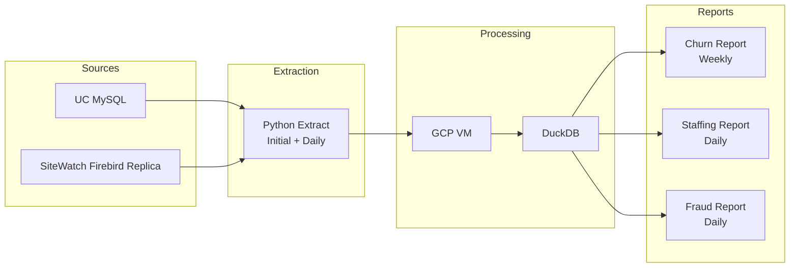

# Phase 1 – Data Pipeline Architecture

## Overview

Phase 1 focuses on building the initial reporting platform using Python extraction pipelines and DuckDB for analytics.

### Scope

* Churn Report
* Staffing Report
* Fraud Report

---

## Architecture Flow

---

## Components

**Sources**

* UC MySQL
* SiteWatch Firebird replica database

**Ingestion**

* Python scripts perform initial and daily extraction.

**Compute**

* Runs on a GCP VM.

**Storage / Query Engine**

* DuckDB used for analytics and report generation.

**Outputs**

* Weekly Churn Report
* Daily Staffing Report
* Daily Fraud Report
