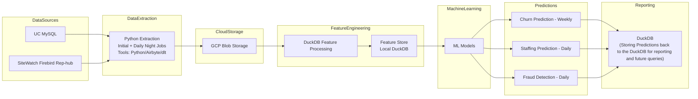

# Phase 1 – ML Reporting Pipeline Architecture

## Overview

Phase 1 builds the initial ML-driven reporting system. Data is extracted nightly from operational databases, stored in cloud blob storage, processed using DuckDB for feature engineering, and used by ML models to generate predictive reports.

### Scope

* Churn Prediction
* Staffing Prediction
* Fraud Detection

---

# Architecture Flow

---

# Pipeline Components

## Data Sources

Operational databases used by the car wash platform.

* UC MySQL
* SiteWatch Firebird

---

## Data Extraction

Python ETL jobs perform:

* Initial full extraction
* Daily incremental extraction
* Scheduled **nightly runs**

These jobs extract operational data from both databases.

---

## Cloud Storage

Extracted data is stored in:

**GCP Blob Storage**

Benefits:

* Cheap storage
* Decouples ingestion from analytics
* Enables reprocessing if needed

---

## Feature Engineering

DuckDB reads the extracted files from GCP Blob storage.

Tasks include:

* Data cleaning
* Aggregations
* Feature creation
* Behavioral metrics

The resulting **feature set is stored in a local DuckDB database**.

---

## Machine Learning Layer

ML models run on the engineered feature set.

Models predict:

* Customer churn probability
* Future staffing demand
* Fraud anomalies

---

## Outputs

The system generates prediction reports:

* **Churn Prediction Report**
* **Staffing Forecast Report**
* **Fraud Detection Report**

These reports can be scheduled or shared with stakeholders.
