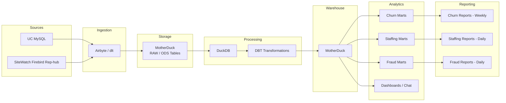

# Phase 2 – Advanced Data Platform Architecture

## Overview

Phase 2 introduces a modern ELT pipeline using automated ingestion tools and a scalable analytical warehouse.

### Scope

* Additional analytics use cases
* Data warehouse
* Dashboards and chat interfaces

---

## Architecture Flow

---

## Components

**Sources**

* UC MySQL
* SiteWatch Firebird replica

**Ingestion**

* Airbyte or dlt pipelines

**Storage Layer**

* RAW / ODS tables

**Processing**

* DuckDB used for compute
* dbt handles transformations

**Warehouse**

* MotherDuck for centralized analytics storage

**Consumption**

* Reports
* Dashboards
* Chat interfaces over analytics data
